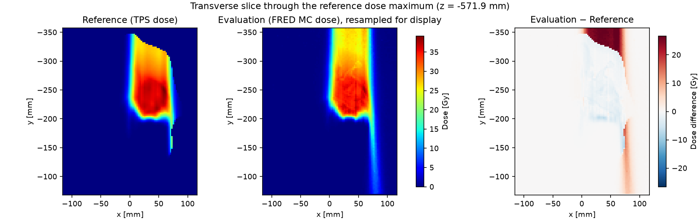
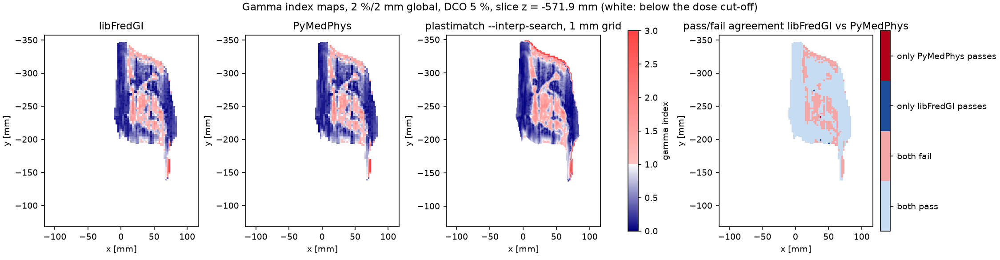
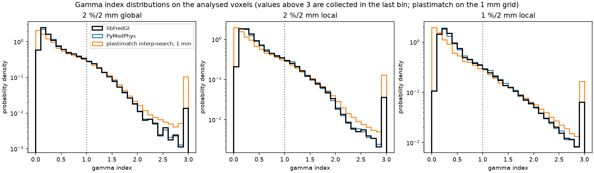
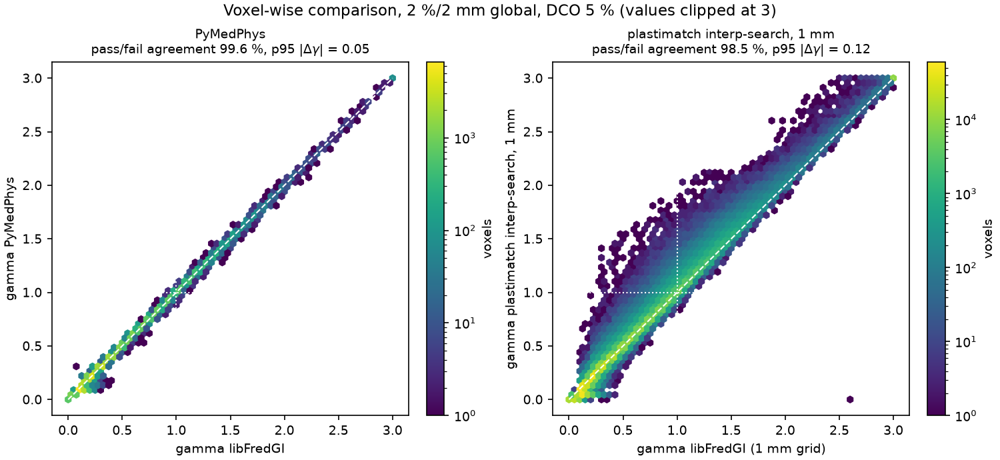
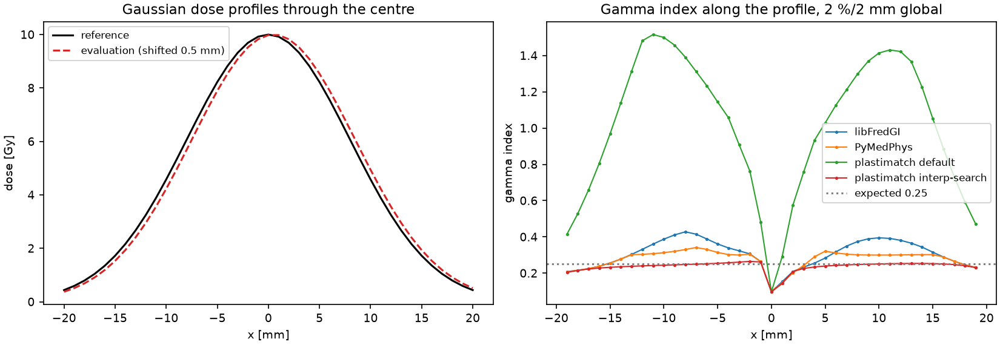

.. _GammaIndexValidation:

Gamma Index Validation Report
=================================

This report documents the validation of the gamma index (GI) analysis implemented in FREDtools (function :func:`fredtools.calcGammaIndex`, computation engine ``libFredGI``) against two independent, open-source implementations: the `PyMedPhys <https://docs.pymedphys.com/>`_ Python library and the `plastimatch <https://plastimatch.org/>`_ image computation toolkit. It describes the test data, the algorithms of the three tools, the metrics used for the comparison and the results, and it explains why the results of different gamma index tools are never exactly the same.

The validation was performed on 5 September 2026 with FREDtools 0.8.24 (``libFredGI`` 4.2), PyMedPhys 0.41.0 and plastimatch 1.9.4, using Python 3.12.3, SimpleITK 2.5.6 and NumPy 2.5.2.

Purpose and acceptance criterion
------------------------------------------------

The gamma index of a reference dose distribution with respect to an evaluation dose distribution has a unique mathematical definition (see below), but every implementation has to approximate the minimisation over the continuous evaluation dose distribution with a finite search. The purpose of this validation is to demonstrate that the ``libFredGI`` engine distributed with FREDtools produces gamma index maps and pass rates consistent with established implementations.

The acceptance criterion is defined on the gamma index pass rate (GIPR), which is the quantity used in clinical practice, for instance in the patient-specific quality assurance recommended by the AAPM Task Group 218 [Miften2018]_:

    The implementation is considered correct when the GIPR calculated with ``libFredGI`` agrees within ±1 percentage point (pp) with the GIPR calculated with an independent implementation for the same data, the same criteria and equivalent settings.

The voxel-wise agreement of the gamma index values is reported as supporting evidence.

Gamma index definition
------------------------------------------------

The gamma index was introduced by Low et al. [Low1998]_ as a combined measure of the dose difference and the distance-to-agreement (DTA) between a reference dose distribution :math:`D_r` and an evaluation dose distribution :math:`D_e`. For every reference point :math:`\mathbf{r}_r` the quantity

.. math::

   \Gamma(\mathbf{r}_r, \mathbf{r}_e) = \sqrt{\frac{|\mathbf{r}_e - \mathbf{r}_r|^2}{\Delta d^2} + \frac{\left(D_e(\mathbf{r}_e) - D_r(\mathbf{r}_r)\right)^2}{\Delta D^2}}

is minimised over all evaluation points :math:`\mathbf{r}_e`:

.. math::

   \gamma(\mathbf{r}_r) = \min_{\mathbf{r}_e} \Gamma(\mathbf{r}_r, \mathbf{r}_e),

where :math:`\Delta d` is the DTA criterion (e.g. 2 mm) and :math:`\Delta D` is the dose difference criterion. The reference point passes the test when :math:`\gamma \le 1` and fails otherwise. The GIPR is the fraction of the analysed reference points with :math:`\gamma \le 1`. The accuracy of the gamma index depends on how densely the evaluation dose distribution is sampled in the minimisation: a search restricted to the grid points overestimates the gamma index, and an interpolation of the evaluation dose between the grid points is required for reliable results [Low2003]_. Efficient implementations restrict the search to the distance at which a smaller value of :math:`\Gamma` is still possible [Wendling2007]_ [Gu2011]_.

The dose difference criterion is given in percent and can be interpreted in two ways:

- *global*: :math:`\Delta D` is a percentage of a global normalisation dose, by default the maximum dose of the reference distribution;
- *local*: :math:`\Delta D` is a percentage of the local reference dose :math:`D_r(\mathbf{r}_r)`.

Only reference points with a dose not lower than the dose cut-off (DCO), given as a fraction of the global normalisation dose, are analysed. In FREDtools, voxels below the DCO are marked with -1 in the gamma index map, the search step is defined by the ``stepSize`` parameter (by default DTA/10) and the global normalisation dose can be set with the ``globalNorm`` parameter (by default the maximum of the reference image).

Test data
------------------------------------------------

The validation uses the dose distribution of one field of a two-field proton pencil beam scanning plan (70 Gy in 35 fractions, range shifter in both fields) prepared in the Eclipse treatment planning system (Varian Medical Systems) on the CT of an anthropomorphic head phantom (CIRS model 731-HN) with a spherical target. The reference image is the field dose exported from the treatment planning system, and the evaluation image is the same field recalculated with the FRED Monte Carlo code and scaled to the total RBE-weighted dose of the plan (35 fractions, RBE 1.1). The two images have different grids (Table 1), which is the typical situation in the verification of Monte Carlo dose calculations, and which requires an interpolation of the evaluation dose. The dose distributions are shown in Figure 1. The treatment planning system reports no dose in the air in front of the phantom (upper part of Figure 1), whereas the Monte Carlo code scores the dose also there; this region is below the dose cut-off in the reference image and is not analysed. The data are used in the FREDtools development only and are not distributed with the package.

.. table-begin: data

.. list-table:: Table 1. Test data.
   :header-rows: 1
   :align: center

   * - Image
     - Size [voxels]
     - Spacing [mm]
     - Extent [mm]
     - Max dose [Gy]
     - Voxels
   * - Reference (TPS dose)
     - 93×116×121
     - 2.5 × 2.5 × 2.4
     - 232.5 × 290.0 × 290.4
     - 39.12
     - 1 305 348
   * - Evaluation (FRED MC dose)
     - 155×191×192
     - 1.5 × 1.5 × 1.5
     - 232.5 × 286.5 × 288.0
     - 39.43
     - 5 684 160

.. table-end: data

   Figure 1. Transverse slice through the maximum of the reference dose: reference dose (left), evaluation dose resampled to the reference grid for display (middle), and their difference (right).

Criteria and settings
------------------------------------------------

Three sets of criteria were evaluated, all with DTA 2 mm and DCO 5 % of the maximum reference dose:

- 2 %/2 mm with global dose difference,
- 2 %/2 mm with local dose difference,
- 1 %/2 mm with local dose difference.

The global normalisation dose was the maximum of the reference dose (39.12 Gy) in all tools. The interpolation step of the interpolating tools was DTA/10 = 0.2 mm. Table 2 lists the calls of the three tools for the 2 %/2 mm global criteria; the local criteria were selected with ``DDType="local"``, ``local_gamma=True`` and ``--local-gamma``, respectively, and the 1 % dose difference with ``DD=1``, ``dose_percent_threshold=1`` and ``--dose-tolerance 0.01``.

.. list-table:: Table 2. Calls of the tools for the 2 %/2 mm global criteria with DCO 5 %.
   :header-rows: 1
   :align: center

   * - Tool
     - Call
   * - FREDtools 0.8.24, ``libFredGI`` 4.2
     - ``calcGammaIndex(imgRef, imgEval, DD=2, DTA=2, DCO=0.05, DDType="global")`` with the default ``stepSize=10``, ``fractionalStepSize=True``, ``globalNorm=None`` and ``mode="gamma"``
   * - PyMedPhys 0.41.0
     - ``pymedphys.gamma(axesRef, doseRef, axesEval, doseEval, dose_percent_threshold=2, distance_mm_threshold=2, lower_percent_dose_cutoff=5, interp_fraction=10, max_gamma=None, local_gamma=False, global_normalisation=None)``
   * - plastimatch 1.9.4
     - ``plastimatch gamma --dose-tolerance 0.02 --dta-tolerance 2 --analysis-threshold 0.05 --ref-only-threshold --gamma-max 3 --interp-search --inherent-resample 1.0 ref.mha eval.mha``

Algorithms compared
------------------------------------------------

libFredGI (FREDtools)
^^^^^^^^^^^^^^^^^^^^^^^^^^^^^^^^^^^^^^^^^^^^^^^^

The engine, developed by Angelo Schiavi, is a multithreaded C++ shared library distributed with FREDtools in binary form; the following description is based on its interface and diagnostic output. It does not resample the input images. For every reference voxel above the DCO, the evaluation dose is interpolated from the neighbouring evaluation voxels at points of a search pattern with a step of DTA/``stepSize`` (0.2 mm here), independently of the evaluation grid spacing. The search region expands in shells of width DTA (0–DTA, DTA–2·DTA, …) and the minimum :math:`\Gamma` is updated until no smaller value can be found in a further shell. The result is a gamma index map on the reference grid with -1 for the voxels below the DCO.

PyMedPhys
^^^^^^^^^^^^^^^^^^^^^^^^^^^^^^^^^^^^^^^^^^^^^^^^

PyMedPhys [Biggs2022]_ implements the gamma index in the ``pymedphys.gamma`` function following the ideas of Wendling et al. [Wendling2007]_. The evaluation dose is interpolated linearly at points distributed on spherical shells of increasing radius :math:`r` around each reference point, with the radius increasing in steps of DTA/``interp_fraction``. For each radius the minimum dose difference on the shell is combined with :math:`r` into :math:`\Gamma`, and the running minimum is kept. A reference point is removed from the search once :math:`r/\Delta d` exceeds its current gamma index, since more distant points cannot lower it any more. Reference points below the dose cut-off are returned as NaN. The calculation is exact in the sense of the minimisation over the sampled points, with no upper limit of the gamma index when ``max_gamma`` is not set.

plastimatch
^^^^^^^^^^^^^^^^^^^^^^^^^^^^^^^^^^^^^^^^^^^^^^^^

The ``plastimatch gamma`` command [PlastimatchDoc]_ (class ``Gamma_dose_comparison`` in the plastimatch source code) first resamples the evaluation image onto the reference grid with linear interpolation. The gamma index of a reference voxel is then the minimum of :math:`\Gamma` over the evaluation *grid voxels* within a neighbourhood of ``gamma-max``·DTA, without any interpolation between the grid points. Consequently, the smallest non-zero distance that can be tested is the voxel size of the reference grid, and the gamma index is systematically overestimated when the voxel size is comparable to or larger than the DTA. Two options mitigate this:

- ``--interp-search`` projects the reference point, in the normalised four-dimensional space of the coordinates and the dose, onto the segments connecting each visited grid voxel to its 26 neighbours, and accepts the projection when it falls inside the segment. This is an interpolation along the grid edges and diagonals only.
- ``--inherent-resample <spacing>`` resamples the reference image (and hence the evaluation image) to a finer grid before the search.

The gamma index is capped at ``gamma-max`` (3 in this validation), the voxels that are not analysed are set to 0, and the analysis threshold is applied to the reference dose only when ``--ref-only-threshold`` is given, which corresponds to the DCO definition of FREDtools and PyMedPhys. Note that version 1.9.4 terminated with a segmentation fault when reading the MetaImage files with double-precision voxel values, so the input images were converted to single precision.

The comparison presented below uses plastimatch with the interpolated search and the reference resampled to 1 mm (``--interp-search --inherent-resample 1.0``), which is the most accurate mode of the tool for the test data. It returns the gamma index map on the 1 mm grid, so it is compared with ``libFredGI`` run on the same resampled reference image (with the global normalisation dose kept at the maximum of the original reference, as plastimatch does). The other two modes were also run and are mentioned here as a caveat for users comparing with plastimatch directly on the native 2.5 mm grid of the reference. The default discrete search gives GIPR values of 55.30 %, 23.74 % and 11.26 % for the three criteria (Table 3 gives 87.86 %, 85.42 % and 82.33 % for ``libFredGI``): with a voxel size larger than the DTA, the smallest displacement that can be tested, one voxel, already contributes 2.5 mm / 2 mm = 1.25 to the gamma index, so that a voxel passes only when the resampled evaluation dose agrees within the dose tolerance at the same position. The interpolated search on the native grid gives 84.48 %, 82.06 % and 78.50 %, i.e. 3.3–3.8 pp less than ``libFredGI``, with a voxel-wise pass/fail agreement of 93.7–94.8 %; the search along the segments between the grid voxels can still miss the true minimum, and the evaluation dose has already been resampled to the coarse reference grid. Only the resampling of the reference to a grid finer than the evaluation grid removes this dependence on the reference voxel size.

Why the results are never identical
^^^^^^^^^^^^^^^^^^^^^^^^^^^^^^^^^^^^^^^^^^^^^^^^

The gamma index is a minimum over a continuous evaluation dose distribution that is only known on a discrete grid. Each tool approximates this minimisation differently, and small differences of the gamma index values are inherent to the method:

1. *Discretisation of the search space.* ``libFredGI`` samples the evaluation dose with a 0.2 mm step in expanding shells, PyMedPhys on spherical shells with a 0.2 mm radial step, and plastimatch only at the grid voxels or along the segments between them; plastimatch additionally stops the search at ``gamma-max``. The position of the true minimum is therefore approximated with a different accuracy and the gamma index is overestimated by a different amount.
2. *Interpolation of the evaluation dose.* ``libFredGI`` and PyMedPhys interpolate the evaluation dose from its native grid, whereas plastimatch resamples it onto the reference grid first, which for a Monte Carlo dose also smooths the statistical noise and changes the dose values that are compared.
3. *Handling of the boundaries.* The tools differ in how they treat search points outside the evaluation image and reference voxels lying exactly at the dose cut-off, which changes the set of analysed voxels by a few voxels.
4. *Numerical precision.* ``libFredGI`` and plastimatch compute in single precision and PyMedPhys in double precision.

As a result, individual gamma index values differ typically by a few hundredths, the differences are largest in the high dose gradients, and voxels with a gamma index close to 1 can change from passing to failing between the tools. The GIPR, which counts these voxels, is therefore expected to differ by a fraction of a percentage point between correct implementations, and bit-identical gamma index maps must not be expected.

Metrics
------------------------------------------------

For every criterion and tool the following quantities were calculated on the *analysed voxels*, i.e. the reference voxels with a dose of at least 5 % of the maximum reference dose. For ``libFredGI`` and PyMedPhys the analysed voxels are those with a valid gamma index value in the map (not -1 or NaN, respectively). For plastimatch, whose maps hold 0 for both non-analysed voxels and a perfect agreement, the analysed voxels are reconstructed by thresholding the reference image that the tool has processed (the original grid or the 1 mm resampled grid); this reconstruction can differ from the internal selection of plastimatch by single voxels at the threshold.

- GIPR [%]: fraction of the analysed voxels with :math:`\gamma \le 1`, calculated for each tool on its own set of analysed voxels.
- Statistics of the gamma index: mean, median, standard deviation and 95th percentile of the values clipped at 3 (because the plastimatch maps are capped at 3), and the maximum value for the uncapped tools.
- Voxel-wise comparison with ``libFredGI`` on the common analysed voxels: pass/fail agreement, i.e. the fraction of the voxels with the same outcome of the test in both tools; the number of voxels passing in only one of the tools; the bias, mean and 95th percentile of :math:`\Delta\gamma = \gamma_\mathrm{tool} - \gamma_\mathrm{libFredGI}` (values clipped at 3); the fraction of voxels with :math:`|\Delta\gamma| < 0.1`; and the fraction of the disagreeing voxels for which the gamma index of either tool lies within [0.9, 1.1], showing that the disagreements are concentrated at the pass/fail threshold.

Results
------------------------------------------------

The pass rates obtained with the three tools are compared in Table 3, the statistics of the gamma index maps in Table 4 and the voxel-wise agreement of the maps with ``libFredGI`` in Table 5. Figure 2 shows the gamma index maps in the slice of Figure 1, Figure 3 the distributions of the gamma index and Figure 4 the voxel-wise comparison of the values.

.. table-begin: gipr

.. list-table:: Table 3. Gamma index pass rate (GIPR) in [%] for DTA 2 mm and DCO 5 %. Δ is the difference to libFredGI in percentage points; for plastimatch (interpolated search with the reference resampled to 1 mm) the difference is taken to libFredGI run on the same 1 mm reference grid.
   :header-rows: 1
   :align: center

   * - Criterion
     - libFredGI
     - PyMedPhys
     - Δ [pp]
     - libFredGI (1 mm grid)
     - plastimatch interp-search, 1 mm
     - Δ [pp]
   * - 2 %/2 mm global
     - 87.86
     - 87.71
     - -0.15
     - 87.35
     - 86.51
     - -0.84
   * - 2 %/2 mm local
     - 85.42
     - 84.79
     - -0.63
     - 84.99
     - 84.20
     - -0.79
   * - 1 %/2 mm local
     - 82.33
     - 81.42
     - -0.90
     - 82.02
     - 81.09
     - -0.93

.. table-end: gipr

.. table-begin: stats

.. list-table:: Table 4. Gamma index statistics on the analysed voxels. Mean, median, standard deviation and 95th percentile are calculated on values clipped at 3; plastimatch maps are capped at gamma-max = 3.
   :header-rows: 1
   :align: center

   * - Criterion
     - Tool
     - Analysed voxels
     - Mean
     - Median
     - Std
     - 95th percentile
     - Max
     - γ ≥ 3 [%]
   * - 2 %/2 mm global
     - libFredGI
     - 61 625
     - 0.47
     - 0.32
     - 0.42
     - 1.31
     - 6.34
     - 0.12
   * - 2 %/2 mm global
     - PyMedPhys
     - 61 631
     - 0.47
     - 0.31
     - 0.42
     - 1.31
     - 6.32
     - 0.12
   * - 2 %/2 mm global
     - libFredGI (1 mm grid)
     - 939 675
     - 0.48
     - 0.31
     - 0.48
     - 1.36
     - 18.94
     - 0.97
   * - 2 %/2 mm global
     - plastimatch interp-search, 1 mm
     - 939 693
     - 0.48
     - 0.31
     - 0.51
     - 1.43
     - ≥ 3 (capped)
     - 0.99
   * - 2 %/2 mm local
     - libFredGI
     - 61 621
     - 0.53
     - 0.37
     - 0.45
     - 1.43
     - 10.80
     - 0.34
   * - 2 %/2 mm local
     - PyMedPhys
     - 61 631
     - 0.52
     - 0.38
     - 0.46
     - 1.43
     - 10.72
     - 0.34
   * - 2 %/2 mm local
     - libFredGI (1 mm grid)
     - 939 673
     - 0.55
     - 0.36
     - 0.51
     - 1.50
     - 20.27
     - 1.22
   * - 2 %/2 mm local
     - plastimatch interp-search, 1 mm
     - 939 693
     - 0.52
     - 0.33
     - 0.55
     - 1.58
     - ≥ 3 (capped)
     - 1.25
   * - 1 %/2 mm local
     - libFredGI
     - 61 618
     - 0.60
     - 0.41
     - 0.52
     - 1.69
     - 13.10
     - 0.57
   * - 1 %/2 mm local
     - PyMedPhys
     - 61 631
     - 0.59
     - 0.40
     - 0.53
     - 1.70
     - 13.03
     - 0.58
   * - 1 %/2 mm local
     - libFredGI (1 mm grid)
     - 939 673
     - 0.61
     - 0.40
     - 0.56
     - 1.76
     - 20.28
     - 1.37
   * - 1 %/2 mm local
     - plastimatch interp-search, 1 mm
     - 939 693
     - 0.57
     - 0.34
     - 0.63
     - 1.90
     - ≥ 3 (capped)
     - 1.55

.. table-end: stats

.. table-begin: agreement

.. list-table:: Table 5. Voxel-wise comparison with libFredGI on the common analysed voxels. Δγ = γ(tool) − γ(libFredGI) with values clipped at 3.
   :header-rows: 1
   :align: center

   * - Criterion
     - Tool vs libFredGI
     - Common voxels
     - Pass/fail agreement [%]
     - Only libFredGI passes
     - Only tool passes
     - Bias Δγ
     - Mean \|Δγ\|
     - 95th perc. \|Δγ\|
     - \|Δγ\| < 0.1 [%]
     - Disagreements with γ ∈ [0.9, 1.1] [%]
   * - 2 %/2 mm global
     - PyMedPhys
     - 61 625
     - 99.64
     - 156
     - 68
     - -0.002
     - 0.011
     - 0.05
     - 99.5
     - 100.0
   * - 2 %/2 mm global
     - plastimatch interp-search, 1 mm (vs libFredGI on the 1 mm grid)
     - 939 675
     - 98.52
     - 10 874
     - 2 990
     - -0.004
     - 0.038
     - 0.12
     - 92.2
     - 92.9
   * - 2 %/2 mm local
     - PyMedPhys
     - 61 621
     - 99.14
     - 458
     - 75
     - -0.010
     - 0.031
     - 0.11
     - 93.8
     - 100.0
   * - 2 %/2 mm local
     - plastimatch interp-search, 1 mm (vs libFredGI on the 1 mm grid)
     - 939 673
     - 98.34
     - 11 496
     - 4 116
     - -0.027
     - 0.066
     - 0.21
     - 78.7
     - 91.4
   * - 1 %/2 mm local
     - PyMedPhys
     - 61 618
     - 98.86
     - 625
     - 76
     - -0.013
     - 0.041
     - 0.15
     - 90.3
     - 100.0
   * - 1 %/2 mm local
     - plastimatch interp-search, 1 mm (vs libFredGI on the 1 mm grid)
     - 939 673
     - 97.95
     - 13 985
     - 5 275
     - -0.034
     - 0.089
     - 0.28
     - 69.2
     - 85.9

.. table-end: agreement

   Figure 2. Gamma index maps for the 2 %/2 mm global criteria in the transverse slice of Figure 1 calculated with ``libFredGI`` and PyMedPhys on the reference grid and with plastimatch (``--interp-search``) on the reference resampled to 1 mm (white: voxels below the dose cut-off), and the map of the pass/fail agreement between ``libFredGI`` and PyMedPhys.

   Figure 3. Distributions of the gamma index on the analysed voxels for the three criteria calculated with ``libFredGI`` and PyMedPhys on the reference grid and with plastimatch on the 1 mm grid; values above 3 are collected in the last bin. The dotted line marks the pass/fail threshold.

   Figure 4. Voxel-wise comparison of the gamma index values for the 2 %/2 mm global criteria: PyMedPhys against ``libFredGI`` on the reference grid (left) and plastimatch with ``--interp-search --inherent-resample 1.0`` against ``libFredGI`` run on the same 1 mm reference grid (right). The colour scale is logarithmic in the number of voxels; the dashed line is the identity and the dotted lines mark :math:`\gamma = 1`.

libFredGI and PyMedPhys
^^^^^^^^^^^^^^^^^^^^^^^^^^^^^^^^^^^^^^^^^^^^^^^^

For the three criteria the GIPR of ``libFredGI`` is higher than that of PyMedPhys by 0.15, 0.63 and 0.90 pp (Table 3), which is within the acceptance criterion of ±1 pp. The two gamma index maps agree closely (Table 5, Figures 2 and 4): the pass/fail outcome is the same in 99.6 %, 99.1 % and 98.9 % of the analysed voxels, the mean absolute difference of the gamma index is 0.01–0.04, its 95th percentile 0.05–0.15 and the bias is below 0.015. In all voxels with a different outcome the gamma index of at least one of the tools lies within [0.9, 1.1], i.e. the disagreements are confined to the voxels at the pass/fail threshold, where the small differences resulting from the different sampling of the search space decide the outcome. The voxels passing only in ``libFredGI`` outnumber the voxels passing only in PyMedPhys (e.g. 156 versus 68 for the 2 %/2 mm global criteria), which explains the slightly higher pass rate of ``libFredGI``; the effect is largest for the local dose difference criteria, for which the dose tolerance in the low dose region is small and the gamma index changes rapidly between neighbouring voxels. The statistics of the maps (Table 4) are practically identical: the mean gamma index is 0.47 versus 0.47, 0.53 versus 0.52 and 0.60 versus 0.59, the 95th percentile 1.31 versus 1.31, 1.43 versus 1.43 and 1.69 versus 1.70, and the maximum 6.34 versus 6.32, 10.80 versus 10.72 and 13.10 versus 13.03 for the three criteria. ``libFredGI`` returns -1 for 6, 10 and 13 of the 61 631 voxels above the dose cut-off; these voxels lie at the border of the analysed region, adjacent to voxels below the cut-off, and their exclusion changes the GIPR by less than 0.02 pp.

libFredGI and plastimatch
^^^^^^^^^^^^^^^^^^^^^^^^^^^^^^^^^^^^^^^^^^^^^^^^

Plastimatch with the interpolated search on the reference resampled to 1 mm agrees with ``libFredGI`` run on the same 1 mm reference grid within 0.84, 0.79 and 0.93 pp of GIPR (Table 3), i.e. within the acceptance criterion for all three criteria, with a pass/fail agreement of 98.5 %, 98.3 % and 98.0 %, a mean absolute difference of the gamma index of 0.04–0.09 and 86–93 % of the disagreements at the threshold (Table 5, Figures 2 and 4). The agreement is somewhat looser than with PyMedPhys, as expected from the coarser interpolation along the grid segments and from the resampling of the evaluation dose, but the statistics of the maps are again very close (Table 4): the mean gamma index is 0.48 versus 0.48, 0.55 versus 0.52 and 0.61 versus 0.57, and the 95th percentile 1.36 versus 1.43, 1.50 versus 1.58 and 1.76 versus 1.90 for ``libFredGI`` and plastimatch, respectively. The gamma index on the 1 mm grid differs slightly from the one on the native grid also for ``libFredGI`` itself (GIPR 87.35 % versus 87.86 % for the 2 %/2 mm global criteria), because the linearly resampled reference is a different, smoother dose distribution with 15 times more voxels.

Analytical checks
------------------------------------------------

The three tools were also run on synthetic dose distributions with a known gamma index (Table 6). A Gaussian dose distribution (σ = 8 mm, 10 Gy at the maximum, 41 × 41 × 41 voxels of 1 mm) was compared with itself (case A), with a copy shifted by exactly one voxel (case B), for which the maximum gamma index is 1 mm / 2 mm = 0.5 and is reached where the dose gradient is high, and with a copy shifted by half a voxel (case C), for which the expected gamma index is 0.5 mm / 2 mm = 0.25 where the shifted dose can be interpolated exactly. A uniform dose of 10 Gy (21 × 21 × 21 voxels of 1 mm) was compared with 10.1 Gy for the local and global 2 % criteria (cases D1 and D2, gamma index 0.5 everywhere) and with 10.3 Gy (case D3, gamma index 1.5 everywhere, GIPR 0 %). For plastimatch, the default and the interpolated search were evaluated on the same grid, so no resampling is involved.

.. table-begin: synthetic

.. list-table:: Table 6. Analytical checks on synthetic images (2 %/2 mm, DCO 5 %, 1 mm voxels).
   :header-rows: 1
   :align: center

   * - Case
     - Tool
     - Expected
     - Max γ
     - Max \|γ − expected\|
     - GIPR [%]
   * - A: identical Gaussian (sigma 8 mm)
     - libFredGI
     - γ = 0
     - 0.0000
     - 0.0000
     - 100.00
   * - A: identical Gaussian (sigma 8 mm)
     - PyMedPhys
     - γ = 0
     - 0.0000
     - 0.0000
     - 100.00
   * - A: identical Gaussian (sigma 8 mm)
     - plastimatch default
     - γ = 0
     - 0.0000
     - 0.0000
     - 100.00
   * - A: identical Gaussian (sigma 8 mm)
     - plastimatch interp-search
     - γ = 0
     - 0.0000
     - 0.0000
     - 100.00
   * - B: Gaussian shifted by 1 mm (one voxel)
     - libFredGI
     - max γ = 0.5
     - 0.5000
     - –
     - 100.00
   * - B: Gaussian shifted by 1 mm (one voxel)
     - PyMedPhys
     - max γ = 0.5
     - 0.5000
     - –
     - 100.00
   * - B: Gaussian shifted by 1 mm (one voxel)
     - plastimatch default
     - max γ = 0.5
     - 0.5000
     - –
     - 100.00
   * - B: Gaussian shifted by 1 mm (one voxel)
     - plastimatch interp-search
     - max γ = 0.5
     - 0.4957
     - –
     - 100.00
   * - C: Gaussian shifted by 0.5 mm (half voxel)
     - libFredGI
     - max γ ≈ 0.25 (see text)
     - 0.4282
     - –
     - 100.00
   * - C: Gaussian shifted by 0.5 mm (half voxel)
     - PyMedPhys
     - max γ ≈ 0.25 (see text)
     - 0.3416
     - –
     - 100.00
   * - C: Gaussian shifted by 0.5 mm (half voxel)
     - plastimatch default
     - max γ ≈ 0.25 (see text)
     - 1.5155
     - –
     - 99.33
   * - C: Gaussian shifted by 0.5 mm (half voxel)
     - plastimatch interp-search
     - max γ ≈ 0.25 (see text)
     - 0.2652
     - –
     - 100.00
   * - D1: uniform 10 Gy vs 10.1 Gy, local DD
     - libFredGI
     - γ = 0.5
     - 0.5000
     - 0.0000
     - 100.00
   * - D1: uniform 10 Gy vs 10.1 Gy, local DD
     - PyMedPhys
     - γ = 0.5
     - 0.5000
     - 0.0000
     - 100.00
   * - D1: uniform 10 Gy vs 10.1 Gy, local DD
     - plastimatch default
     - γ = 0.5
     - 0.5000
     - 0.0000
     - 100.00
   * - D1: uniform 10 Gy vs 10.1 Gy, local DD
     - plastimatch interp-search
     - γ = 0.5
     - 0.5000
     - 0.0000
     - 100.00
   * - D2: uniform 10 Gy vs 10.1 Gy, global DD
     - libFredGI
     - γ = 0.5
     - 0.5000
     - 0.0000
     - 100.00
   * - D2: uniform 10 Gy vs 10.1 Gy, global DD
     - PyMedPhys
     - γ = 0.5
     - 0.5000
     - 0.0000
     - 100.00
   * - D2: uniform 10 Gy vs 10.1 Gy, global DD
     - plastimatch default
     - γ = 0.5
     - 0.5000
     - 0.0000
     - 100.00
   * - D2: uniform 10 Gy vs 10.1 Gy, global DD
     - plastimatch interp-search
     - γ = 0.5
     - 0.5000
     - 0.0000
     - 100.00
   * - D3: uniform 10 Gy vs 10.3 Gy, local DD
     - libFredGI
     - γ = 1.5
     - 1.5000
     - 0.0000
     - 0.00
   * - D3: uniform 10 Gy vs 10.3 Gy, local DD
     - PyMedPhys
     - γ = 1.5
     - 1.5000
     - 0.0000
     - 0.00
   * - D3: uniform 10 Gy vs 10.3 Gy, local DD
     - plastimatch default
     - γ = 1.5
     - 1.5000
     - 0.0000
     - 0.00
   * - D3: uniform 10 Gy vs 10.3 Gy, local DD
     - plastimatch interp-search
     - γ = 1.5
     - 1.5000
     - 0.0000
     - 0.00

.. table-end: synthetic

   Figure 5. Case C: dose profiles through the centre of the Gaussian dose distribution shifted by 0.5 mm (left) and the gamma index along the profile calculated with the tools (right); the dotted line marks the expected value 0.25.

All tools reproduce the exact gamma index in the cases where the minimum of :math:`\Gamma` lies at a tested position: the identical distributions (case A), the shift by one voxel (case B, maximum gamma index 0.5000 for ``libFredGI``, PyMedPhys and the default plastimatch search) and the uniform dose differences (cases D1–D3, gamma index 0.5 and 1.5 to four decimals for all tools, GIPR 100 % and 0 %). With the interpolated search, plastimatch gives 0.4957 in case B, marginally below the exact value, because the straight segments between the grid points in the four-dimensional space lie slightly inside the curved dose profile.

Case C, with a shift of half a voxel, illustrates how the discretisation of the search affects the result (Figure 5). The shift of 0.5 mm is not a multiple of the search step of 0.2 mm used by ``libFredGI`` and PyMedPhys. The closest tested displacements along the profile are 0.4 mm and 0.6 mm, where the remaining dose difference in the steepest part of the profile (dose gradient up to 0.76 Gy/mm, i.e. 0.076 Gy or 0.38 of the dose tolerance for 0.1 mm) increases the gamma index to :math:`\sqrt{0.2^2 + 0.38^2} = 0.43` (``libFredGI``) instead of the exact 0.25. PyMedPhys arrives at 0.34, because the points of its 0.6 mm shell include positions with a component of about 0.5 mm along the profile, where the dose difference vanishes at the cost of a larger distance (:math:`\Gamma \approx 0.3`). The interpolated search of plastimatch, which projects the reference point onto the segments connecting the grid points, finds the minimum along the grid edge almost exactly (0.27), whereas the default search restricted to the grid points, for which the smallest displacement is 1 mm, gives a gamma index up to 1.5 and fails 0.7 % of the voxels of a distribution that differs from the reference only by a sub-millimetre shift. All these values are far below the pass/fail threshold, and the case shows only that correct implementations return different gamma index values in the same situation.

Conclusion
------------------------------------------------

For all three criteria the gamma index pass rate calculated with the FREDtools implementation agrees with PyMedPhys within 0.90 pp and with plastimatch (interpolated search on a common 1 mm grid) within 0.93 pp, which satisfies the acceptance criterion of ±1 pp. The pass/fail outcome agrees in at least 98.9 % (PyMedPhys) and 98.0 % (plastimatch) of the analysed voxels, and the disagreements are confined to the voxels at the pass/fail threshold, as expected from the different discretisation of the search. The analytical checks are reproduced exactly wherever the minimum lies at a tested position, and the case of a sub-voxel shift shows the size of the deviations that must be expected between correct implementations. The gamma index maps of ``libFredGI`` are deterministic: repeated runs with the same input give identical maps, also when the number of threads is changed (verified with 1 and 22 threads).

The gamma index analysis implemented in FREDtools is therefore considered validated. The comparison also shows that a gamma index calculated without interpolation of the evaluation dose, such as the default mode of plastimatch, is not comparable with the interpolating implementations when the voxel size is comparable to or larger than the DTA; comparisons with other tools should be made with an interpolating search and, if the tool resamples the evaluation dose, on a grid finer than the evaluation grid.

References
------------------------------------------------

.. [Low1998] Low, D. A., Harms, W. B., Mutic, S., Purdy, J. A. A technique for the quantitative evaluation of dose distributions. Med. Phys. 25, 656–661 (1998). https://doi.org/10.1118/1.598248

.. [Low2003] Low, D. A., Dempsey, J. F. Evaluation of the gamma dose distribution comparison method. Med. Phys. 30, 2455–2464 (2003). https://doi.org/10.1118/1.1598711

.. [Wendling2007] Wendling, M., Zijp, L. J., McDermott, L. N., Smit, E. J., Sonke, J.-J., Mijnheer, B. J., van Herk, M. A fast algorithm for gamma evaluation in 3D. Med. Phys. 34, 1647–1654 (2007). https://doi.org/10.1118/1.2721657

.. [Gu2011] Gu, X., Jia, X., Jiang, S. B. GPU-based fast gamma index calculation. Phys. Med. Biol. 56, 1431–1441 (2011). https://doi.org/10.1088/0031-9155/56/5/014

.. [Biggs2022] Biggs, S., Jennings, M., Swerdloff, S., Chlap, P., Lane, D., Rembish, J., McAloney, J., King, P., Ayala, R., Guan, F., Lambri, N., Crewson, C., Sobolewski, M., Reynolds, M. PyMedPhys: A community effort to develop an open, Python-based standard library for medical physics applications. J. Open Source Softw. 7, 4555 (2022). https://doi.org/10.21105/joss.04555 – documentation of the gamma index function: https://docs.pymedphys.com/en/latest/users/ref/lib/gamma.html

.. [PlastimatchDoc] Plastimatch – an open source software for image computation. https://plastimatch.org/ – documentation of the gamma command: https://plastimatch.org/plastimatch.html – source code: https://gitlab.com/plastimatch/plastimatch

.. [Miften2018] Miften, M., Olch, A., Mihailidis, D., Moran, J., Pawlicki, T., Molineu, A., Li, H., Wijesooriya, K., Shi, J., Xia, P., Papanikolaou, N., Low, D. A. Tolerance limits and methodologies for IMRT measurement-based verification QA: Recommendations of AAPM Task Group No. 218. Med. Phys. 45, e53–e83 (2018). https://doi.org/10.1002/mp.12810
