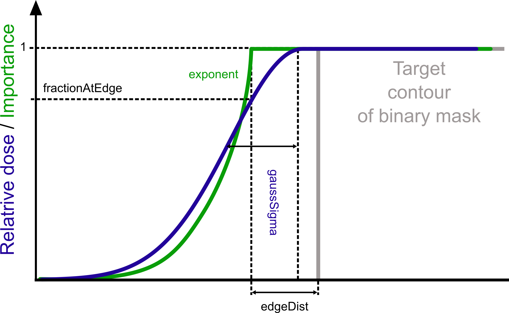

Image Manipulation
=================================

A collection of useful functions to manipulate and change images, implemented in the ``fredtools.ImgManipulate`` subpackage. The image must be an instance of a SimpleITK image and the functions are mostly wrappers for SimpleITK image filters. Check `SimpleITK filters <https://simpleitk.readthedocs.io/en/master/filters.html>`_ for available methods of filtering, registration, etc.

Image manipulation
------------------------------------------------

.. autofunction:: fredtools.mapStructToImg

.. autofunction:: fredtools.floatingToBinaryMask

.. autofunction:: fredtools.cropImgToMask

.. autofunction:: fredtools.setValueMask

.. autofunction:: fredtools.setNaNImg

.. autofunction:: fredtools.resampleImg

.. autofunction:: fredtools.sumImg

.. autofunction:: fredtools.divideImg

.. autofunction:: fredtools.sumVectorImg

.. autofunction:: fredtools.maximumImg

.. autofunction:: fredtools.minimumImg

.. autofunction:: fredtools.meanImg

.. autofunction:: fredtools.getImgBEV

.. autofunction:: fredtools.setIdentityDirection

.. autofunction:: fredtools.overwriteCTPhysicalProperties

.. autofunction:: fredtools.addMarginToMask

.. autofunction:: fredtools.addGaussMarginToMask

.. autofunction:: fredtools.addExpMarginToMask

   Definition of Gaussian and exponential margins.

Subimage extraction
------------------------------------------------

Functions for getting subimages of lower dimension, e.g. a slice or a profile from a 3D image. The image must be an instance of a SimpleITK image and the same image, with the same dimension is returned. The subimages are calculated with a user-defined interpolation. The interpolation of 'nearest', 'linear' and 'spline' with order from 0 to 5 are available.

.. autofunction:: fredtools.getSlice

.. autofunction:: fredtools.getProfile

.. autofunction:: fredtools.getPoint

.. autofunction:: fredtools.getInteg

.. autofunction:: fredtools.getCumSum

.. autofunction:: fredtools.getProfilePoints

Image creation
------------------------------------------------

.. autofunction:: fredtools.createEllipseMask

.. autofunction:: fredtools.createConeMask

.. autofunction:: fredtools.createCylinderMask

.. autofunction:: fredtools.createBoxMask

.. autofunction:: fredtools.createImg

Influence matrix manipulation
------------------------------------------------

Functions for manipulating influence matrices read with :func:`fredtools.getInmFREDSparse`. The influence matrix is defined as an instance of a scipy.sparse.csr_matrix or cupy.sparse.csr_matrix object. In case of the cupy.sparse.csr_matrix object, the calculations are performed on a GPU.

.. autofunction:: fredtools.inmSumVec

.. autofunction:: fredtools.inmSumImg
